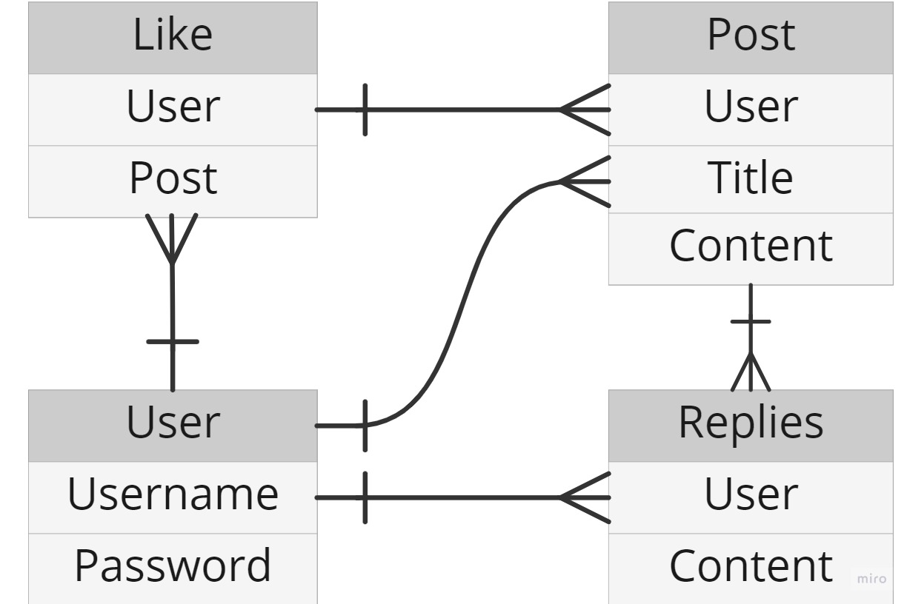

## MVP User Stories
- As a unregistered user, I would like to sign up with username and password.
- As a registered user, I would like to sign in with username and password.
- As a signed in user, I would like to change password.
- As a signed in user, I would like to sign out.
- As a unregistered user, I would like to see all users blog posts.
- As a unregistered user, I would like to see comments on those blog posts.
- As a signed in user, I would to create blog posts.
- As a signed in user, I would to comment on other users' blog posts.
- As a signed in user, I would to update my blog posts and comments.
- As a signed in user, I would to delete my blog posts and comments.

## Routes

### Users
| URL                 | HTTP Verb   | Actions     |
|---------------------|-------------|-------------|
| `/auth/sign-up`     | `POST`      | `new`       |
| `/auth/login`       | `POST`      | `create`    |
| `/auth/logout`      | `DELETE`    | `destroy`   |

### Likes
| URL                 | HTTP Verb   | Actions     |
|---------------------|-------------|-------------|
| `/likes/`           | `GET`       | `index`     |
| `/likes/:postId`    | `POST`      | `create`    |
| `/likes/:postdd`    | `DELETE`    | `delete`    |

### Posts
| URL                 | HTTP Verb   | Actions     |
|---------------------|-------------|-------------|
| `/posts/`           | `GET`       | `index`     |
| `/posts/mine`       | `GET`       | `index`     |
| `/posts/`           | `POST`      | `create`    |
| `/posts/:id`        | `PATCH`     | `update`    |
| `/posts/:id`        | `DELETE`    | `delete`    |

### Replies
| URL                           | HTTP Verb   | Actions
|-------------------------------|-------------|-------------------|
| `/replies/`                   | `GET`       | `index`           |
| `/replies/:postId`            | `POST`      | `create`          |
| `/replies/:postId/:replyId`   | `PATCH `    | `update`          |
| `/replies/:postId/:replyId`   | `DELETE`    | `delete`          |

## Wireframe

## ERD

## Technologies Used
- Django
- Python
- HTML
- CSS
- AWS
